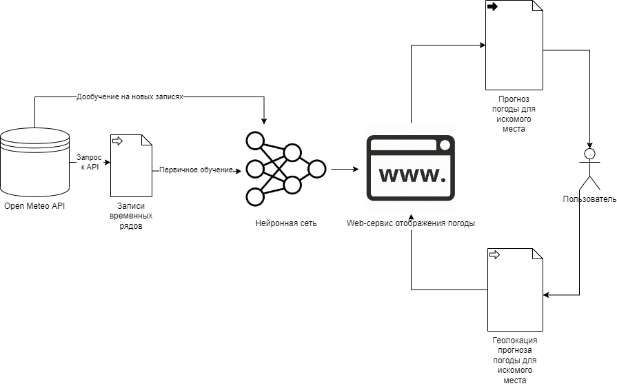

# mlops_project
### Структура проекта:
```
.
├── =1.7
├── Dockerfile
├── __pycache__
│   └── commands.cpython-310.pyc
├── api_test.ipynb
├── checkpoints
│   ├── best-checkpoint-v1.ckpt
│   ├── best-checkpoint-v2.ckpt
│   ├── best-checkpoint.ckpt
│   └── fine_tuned_model.ckpt
├── commands.py
├── config
│   ├── __init__.py
│   └── config.yaml
├── images
│   └── scheme.png
├── infer_data.csv
├── lightning_logs
│   ├── lightning_logs
│   │   ├── version_0
│   │   │   ├── events.out.tfevents.1717777439.Yaroslav.759967.0
│   │   │   ├── events.out.tfevents.1717777466.Yaroslav.759967.1
│   │   │   └── hparams.yaml
│   │   └── version_1
│   │       ├── events.out.tfevents.1717777887.Yaroslav.766945.0
│   │       ├── events.out.tfevents.1717777898.Yaroslav.766945.1
│   │       └── hparams.yaml
│   └── version_0
│       ├── events.out.tfevents.1717801175.Yaroslav.847642.0
│       └── hparams.yaml
├── outputs
│   ├── 2024-06-07
│   │   ├── 23-05-24
│   │   │   └── infer.log
│   │   ├── 23-14-41
│   │   │   └── infer.log
│   │   ├── 23-15-49
│   │   │   └── infer.log
│   │   └── 23-24-12
│   │       └── infer.log
│   └── 2024-06-08
│       ├── 00-13-40
│       │   └── loader.log
│       ├── 00-23-54
│       │   └── infer.log
│       ├── 00-25-05
│       │   └── infer.log
│       ├── 00-25-48
│       │   └── infer.log
│       ├── 00-26-25
│       │   └── infer.log
│       ├── 00-26-49
│       │   └── infer.log
│       ├── 00-28-30
│       │   └── infer.log
│       ├── 00-33-16
│       │   └── infer.log
│       ├── 00-33-43
│       │   └── infer.log
│       ├── 00-35-33
│       │   └── infer.log
│       ├── 00-41-53
│       │   └── infer.log
│       ├── 00-43-41
│       │   └── infer.log
│       ├── 00-45-21
│       │   └── infer.log
│       ├── 00-46-22
│       │   └── infer.log
│       ├── 00-47-09
│       │   └── infer.log
│       ├── 00-50-44
│       │   └── infer.log
│       ├── 00-54-29
│       │   └── infer.log
│       ├── 00-55-26
│       │   └── infer.log
│       ├── 00-57-38
│       │   └── infer.log
│       ├── 01-02-31
│       │   └── infer.log
│       ├── 01-03-29
│       │   └── infer.log
│       ├── 01-15-59
│       │   └── infer.log
│       ├── 01-35-33
│       │   └── infer.log
│       ├── 01-36-10
│       │   └── infer.log
│       ├── 01-42-34
│       │   └── infer.log
│       ├── 01-43-32
│       │   └── infer.log
│       ├── 01-44-23
│       │   └── infer.log
│       └── 01-59-33
│           └── infer.log
├── readme.md
├── requirements.txt
└── weather_forecasting
    ├── __init__.py
    ├── __pycache__
    │   ├── __init__.cpython-310.pyc
    │   ├── infer.cpython-310.pyc
    │   └── loader.cpython-310.pyc
    ├── fine_tune.py
    ├── infer.py
    ├── loader.py
    └── train.py
```
### Таблица обновлений проекта (будет обновляться по ходу выполнения)
|Дата|Название|Краткое описание|
|----|--------|--------|
|23.02.2024|Составлен readme.md|Добавлено текстовое описание проекта: используются временные ряды [погодных данных](https://open-meteo.com/en/docs/historical-weather-api) для прогнозирования метеорологических условий, с помощью [LSTM-nn](https://www.tensorflow.org/tutorials/structured_data/time_series#recurrent_neural_network).|
|06.06.2024|Написан код обучения, дообучения и инференса, сформирован список зависимостей и docker-file|Написан код для получения данных из API. Написан код для обучения нейронки на основе PyTorch_forecasting. Она автоматически дообучается каждые 24 часа, пока предиктит только одну переменную одного временного ряда на 6 часов вперед. Docker Image получается довольно большим из-за того, что pytroch_forecasting ставит с собой торч с кучей зависимостей, хотя по факту используется только lightning.|
|08.06.2024|Добавлены DVC и Hydra|Данные для обучения загружены на Google Drive с помощью DVC, правда, при попытке забилдить DVC сразу вместе с пуллом ссылки на них выходит на аутентификацию и дальше не собирается. Но без этого все ок.|
## Описание проекта:
  1. Формулировка задачи: прогнозирование погодных условий с помощью временных рядов метеоданных. Полученные прогнозы можно использовать для различных целей:
        - Определение потенциальных погодных условий для корректировки стиля верхней одежды
        - Корректировка мелиоративных процессов и управленческих решений (в контексте сельского хозяйства)
        - и другие.
  2. Для формирования качественного прогноза погоды необходимы данные за достаточно длительный период, чтобы учесть как сезонность динамики данных, так и изменения в самой сезонности (например, учета климатических изменений). Предполагается использование обновляющихся исторических погодных данных, представленных в [Open Meteo](https://open-meteo.com/en/docs/historical-weather-api). Доступ к данным формируется с помощью запроса к API, содержатся записи с 1940 года по текущий момент времени, общим объемом около 90 терабайт. Поскольку архив обновляется с 5-дневной задержкой, акуальные данные будут подягиваться через этот [API](https://open-meteo.com/en/docs). Данные обладают следующими особенностями/проблемами:
        - Пространственная точность варьируется от 25 до 9 км (в зависимости от временного периода), что в некоторых случаях может приводить к неточному прогнозу (например, когда данные для одного района берутся из соседнего, в котором, например, не выпадали осадки, что сильно влияет на уровень влажности)
        - Пропуски в данных уже заполнены, что, с одной стороны, облегчает работу с данными, с другой - может серьезно повлиять на валидность прогноза на основе таких данных, поскольку неизвестно, как именно эти пропуски заполнялись. Также неизвестна информация касательно того, какое количество записей отсутствало для конкретной точки в пространстве
  3. Концепцию пайплайна обучения (для обработки, анализа, работы с временными рядами, обучения нейросетей) предполагается использовать из [этого туториала по прогнозированию временных рядов](https://www.tensorflow.org/tutorials/structured_data/time_series#setup), с той лишь разницей, что вместо tensorflow будет применяться pytorch, а период прогнозирования может быть увеличен, поскольку используемый датасет содержит записи за значительно больший период. Наилучшие метрики по качеству прогнозирования в туториале у LSTM-нейросети, поэтому предполагается использование идентичной архитектуры(разумеется, с учетом разницы в датасетах): 
  4. После обучения модели необходимо периодически ее дообучать, поскольку временной ряд будет постоянно пополняться - предлагается дообучать ее каждые сутки (раз в 24 часа). Схема взаимодействия пользователя с сервисом выглядит следующим образом:
  
Поскольку API имеет доступ к большому количеству локаций, стоит ограничить пользовательский выбор возможных локаций, осуществляться который будет с помощью поиска по интерактивной карте, либо же с помощью поиска по названию. Для отправки запросов к обученной нейросети и формированию прогнозов будет использован Flask в связи с API OpenStreetMap.